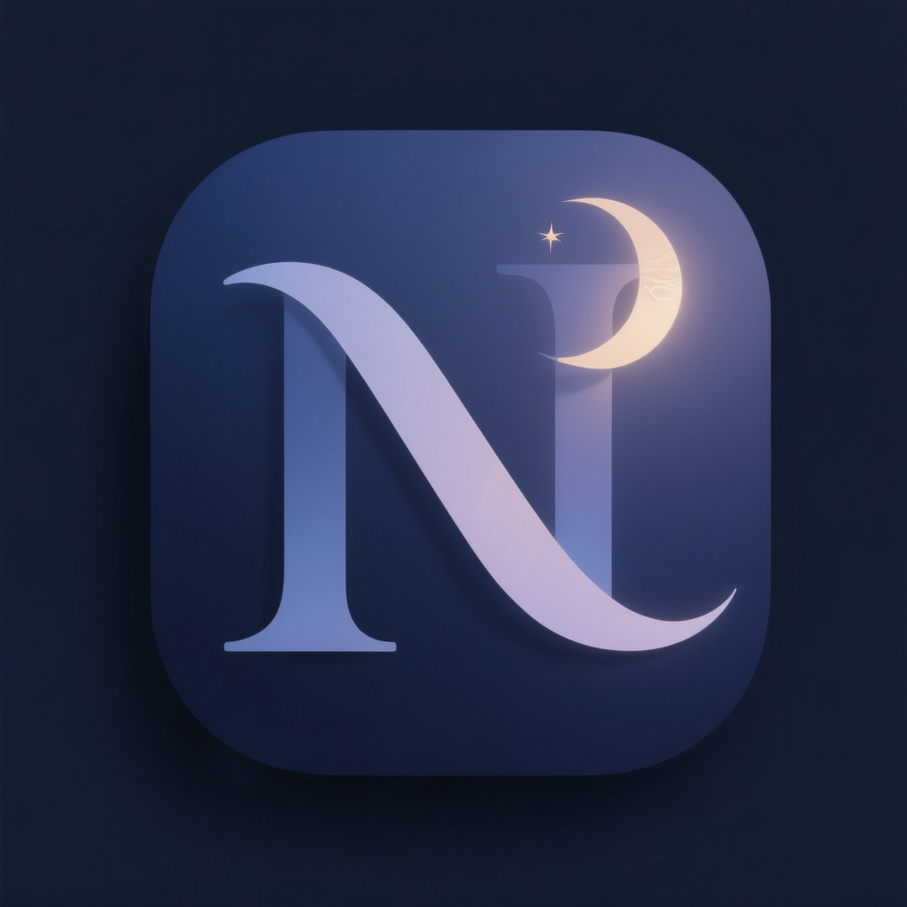
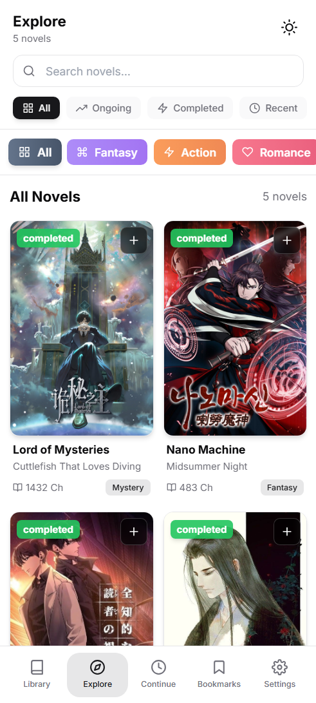
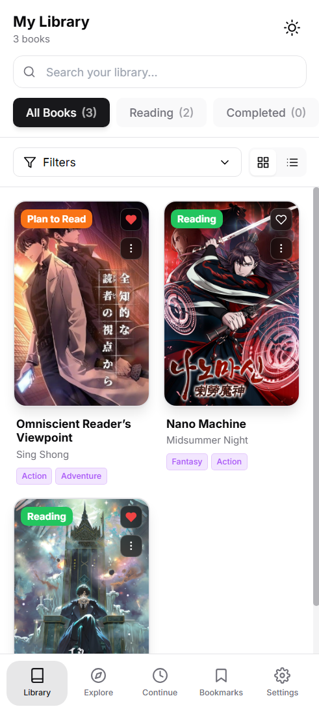
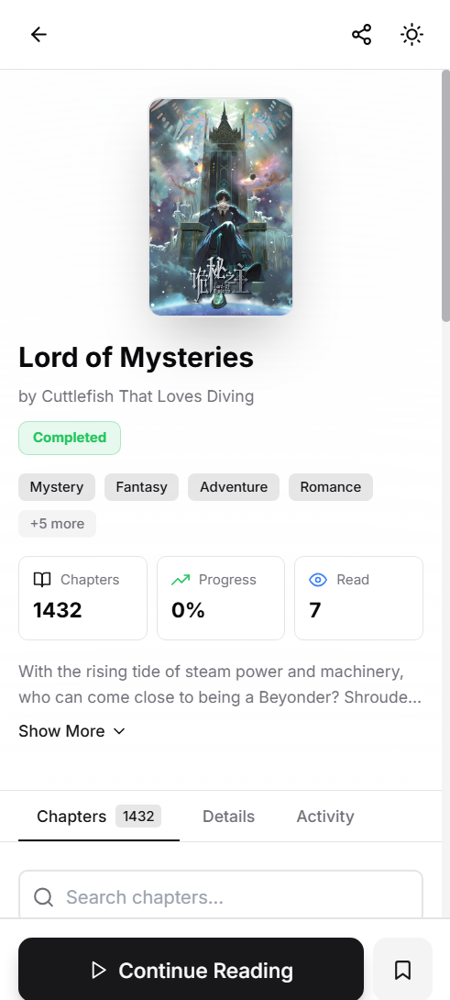
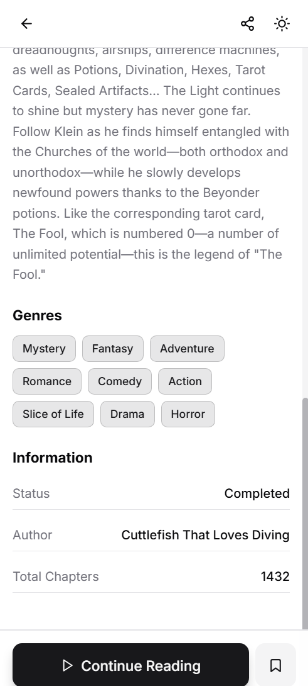

# Nocturne Archive

<div align="center">
  
  <br />
  <h3>Your Personal Web Novel Sanctuary</h3>
  <p>A modern, offline-capable web novel reader and library manager.</p>
</div>

---

## 📖 Overview

**Nocturne Archive** is a feature-rich web application designed for novel enthusiasts who want full control over their reading experience. Built with the latest web technologies, it offers a seamless reading environment that works online and offline.

Whether you're managing a massive collection of EPUBs or following ongoing web serials, Nocturne Archive provides a premium, distraction-free interface to keep your library organized and your reading progress synced.

## ✨ Key Features

- **📚 Comprehensive Library Management**: Easily upload, organize, and manage your novel collection. Support for bulk uploads and metadata parsing.
- **💾 Offline-First Architecture**: Built as a Progressive Web App (PWA) with persistent local storage (IndexedDB/Dexie), ensuring your library is always valid, even without an internet connection.
- **🎨 Customizable Reader**: A powerful reading interface with adjustable fonts, themes, spacing, and layouts to suit your personal reading style.
- **🔄 Progress Tracking**: Never lose your place. Reading progress is automatically saved and synced across devices (when online).
- **📂 File Support**: Native support for EPUB parsing and rendering.
- **🔐 User System**: Secure authentication and user profiles to keep your data private.
- **📱 Responsive Design**: A fluid, app-like experience on both desktop and mobile devices.

## 🛠️ Tech Stack

- **Framework**: [Next.js 15](https://nextjs.org/) (App Router)
- **Language**: [TypeScript](https://www.typescriptlang.org/)
- **UI Library**: [React 19](https://react.dev/)
- **Styling**: [Tailwind CSS](https://tailwindcss.com/)
- **State Management**: [Zustand](https://github.com/pmndrs/zustand)
- **Database**:
  - **Local**: [Dexie.js](https://dexie.org/) (IndexedDB wrapper)
  - **Remote**: [MongoDB](https://www.mongodb.com/) (Mongoose)
- **Animations**: [Framer Motion](https://www.framer.com/motion/)
- **PWA**: [next-pwa](https://github.com/shadowwalker/next-pwa)

## 📸 Gallery

Here's a glimpse into the Nocturne Archive experience:



<br />
<br />



## 🚀 Getting Started

Follow these steps to set up the project locally:

1.  **Clone the repository:**

    ```bash
    git clone https://github.com/yourusername/nocturne-archive.git
    cd nocturne-archive
    ```

2.  **Install dependencies:**

    ```bash
    npm install
    # or
    pnpm install
    # or
    yarn install
    ```

3.  **Environment Setup:**
    Create a `.env` file in the root directory and configure your environment variables (MongoDB URI, JWT secrets, etc.).

4.  **Run the development server:**

    ```bash
    npm run dev
    ```

5.  **Open your browser:**
    Navigate to [http://localhost:3000](http://localhost:3000) to see the application in action.

## 🤝 Contributing

Contributions are welcome! Please feel free to submit a Pull Request.

## 📄 License

This project is licensed under the [MIT](LICENSE) License.
